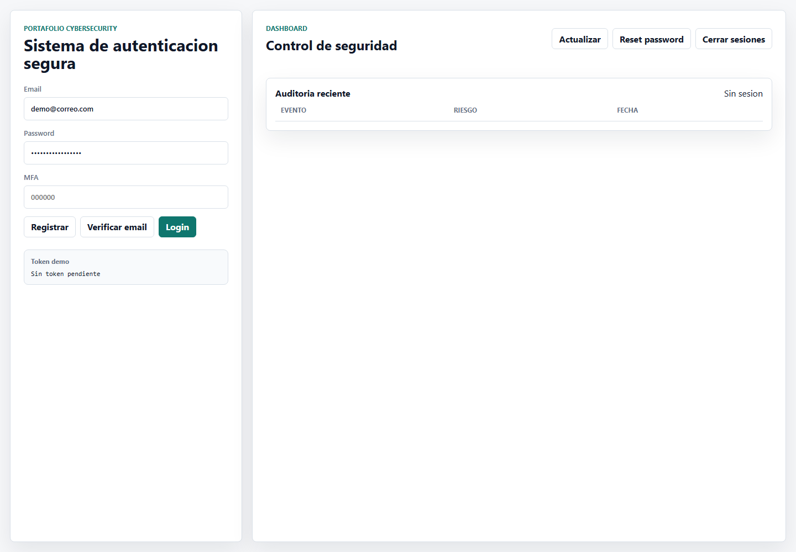
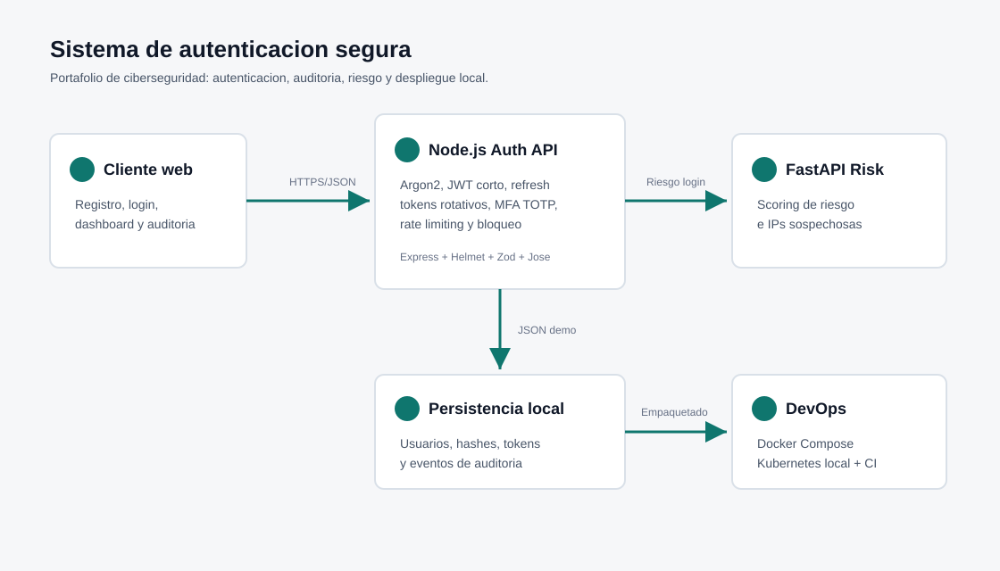

# Sistema de autenticacion segura

Proyecto de portafolio enfocado en ciberseguridad defensiva.
Implementa un flujo de autenticacion con controles reales: hashing seguro,
tokens de corta duracion, refresh tokens rotativos, MFA, auditoria,
rate limiting y scoring de riesgo con un microservicio Python.



## Problema que resuelve

Muchos proyectos de portafolio se quedan en un login basico. Este proyecto
modela un sistema mas cercano a un entorno real, donde iniciar sesion no es
solo comparar usuario y password, sino aplicar controles defensivos y generar
evidencia auditable.

## Funcionalidades

- Registro y login de usuarios.
- Hashing de passwords con Argon2.
- JWT de acceso con expiracion de 15 minutos.
- Refresh tokens rotativos con revocacion.
- MFA con TOTP compatible con apps autenticadoras.
- Verificacion de email con token de un solo uso.
- Recuperacion segura de password e invalidacion de sesiones.
- Rate limiting en rutas de autenticacion.
- Bloqueo temporal despues de intentos fallidos.
- Auditoria de eventos de seguridad.
- Dashboard web con metricas y eventos recientes.
- Microservicio Python/FastAPI para scoring de riesgo.
- Deteccion de IPs sospechosas con lista local o `THREAT_INTEL_URL`.
- Docker Compose para ejecucion local.
- Manifiestos Kubernetes locales.
- CI con GitHub Actions.
- Tests automatizados con Node Test Runner.

## Arquitectura



```text
Cliente web / Postman
    |
    v
Node.js Auth API
    |-- Argon2
    |-- JWT + refresh tokens rotativos
    |-- MFA TOTP
    |-- Auditoria
    |-- JSON local para demo
    |
    v
Python Risk Service
    |-- Scoring de riesgo
    |-- IPs sospechosas
```

## Stack

- Node.js
- Express
- Python
- FastAPI
- Argon2
- JWT con `jose`
- TOTP con `otplib`
- Zod
- Helmet
- Docker
- Kubernetes
- GitHub Actions

## Como correrlo

### API Node.js

```bash
cp .env.example .env
npm install
npm run dev
```

La app queda en:

```text
http://localhost:3000
```

### Servicio Python

Usa Python 3.12.

```bash
cd python-risk-service
python -m venv .venv
.venv\Scripts\activate
pip install -r requirements.txt
uvicorn main:app --reload --port 8000
```

Si `python` no resuelve bien en Windows:

```bash
C:\Users\kevin\AppData\Local\Programs\Python\Python312\python.exe -m venv .venv
.venv\Scripts\python.exe -m pip install -r requirements.txt
.venv\Scripts\python.exe -m uvicorn main:app --reload --port 8000
```

## Flujo demo

1. Abre `http://localhost:3000`.
2. Registra un usuario nuevo.
3. Copia el token demo generado.
4. Presiona "Verificar email".
5. Inicia sesion.
6. Revisa el dashboard de auditoria.
7. Presiona "Actualizar" para rotar el refresh token.

Usuario demo local:

```text
Email: demo@correo.com
Password: PasswordSeguro123
```

El campo MFA debe quedar vacio si no se activo TOTP.

## Endpoints principales

```text
GET  /health
POST /auth/register
POST /auth/verify-email
POST /auth/login
POST /auth/refresh
POST /auth/logout
POST /auth/password/forgot
POST /auth/password/reset
POST /auth/mfa/setup
POST /auth/mfa/enable
POST /auth/mfa/disable
GET  /auth/me
GET  /dashboard/summary
GET  /dashboard/audit
```

## Decisiones de seguridad

- **Argon2**: evita guardar passwords en texto plano y eleva el costo de
  ataques offline.
- **JWT corto**: reduce la ventana de impacto si se filtra un access token.
- **Refresh tokens rotativos**: permite detectar reutilizacion y revocar
  sesiones.
- **MFA TOTP**: agrega segundo factor sin depender de SMS.
- **Rate limiting**: reduce intentos de fuerza bruta automatizados.
- **Bloqueo temporal**: limita ataques repetidos contra una misma cuenta.
- **Auditoria**: deja trazabilidad de eventos relevantes de seguridad.
- **Microservicio Python**: separa scoring de riesgo del core de auth.
- **Docker/Kubernetes**: muestra empaquetado y despliegue reproducible.

## Tests

```bash
npm test
```

La suite valida:

- Hashing y verificacion de password.
- Claims de JWT.
- Tokens opacos almacenados como hash.
- Generacion de secreto TOTP.

## Docker Compose

Define un secreto antes de levantar los servicios:

```bash
$env:JWT_SECRET="pon-un-secreto-largo-y-unico"
docker compose up --build
```

Docker expone solo la API en `127.0.0.1:3000`; el servicio Python queda
interno para la API.

## Kubernetes

Los manifiestos estan en `k8s/`.

```bash
docker build -t secure-auth-api:local .
docker build -t secure-auth-risk-service:local ./python-risk-service
copy k8s\secret.example.yaml k8s\secret.yaml
kubectl apply -f k8s/namespace.yaml
kubectl apply -f k8s/configmap.yaml
kubectl apply -f k8s/secret.yaml
kubectl apply -f k8s/risk-service.yaml
kubectl apply -f k8s/auth-api.yaml
kubectl -n secure-auth port-forward svc/auth-api 3000:3000
```

## CI/CD

El workflow esta en `.github/workflows/ci.yml`.

Ejecuta:

- `npm ci`
- `npm test`
- instalacion de dependencias Python
- `python -m py_compile main.py`

## Documentacion adicional

- [Guion de demo](docs/DEMO.md)
- [Checklist de publicacion](docs/PUBLISHING.md)
- [Manifiestos Kubernetes](k8s/README.md)

## Como explicarlo en entrevistas

> Disene un sistema de autenticacion segura con Node.js y Python. Implemente
> Argon2, JWT de corta duracion, refresh tokens rotativos, MFA con TOTP,
> verificacion de email, recuperacion segura de password, rate limiting,
> bloqueo por fuerza bruta y auditoria. Tambien separe un microservicio
> Python para scoring de riesgo e IPs sospechosas, y agregue Docker,
> Kubernetes y CI para demostrar buenas practicas de despliegue.

## Limitaciones conocidas

- Usa JSON local para demo; PostgreSQL seria el siguiente paso productivo.
- El envio de email esta simulado con token demo.
- `DEV_EXPOSE_TOKENS=true` debe usarse solo en desarrollo.
- El scoring de riesgo es demostrativo, no reemplaza un motor de fraude real.

## Mejoras futuras

- SMTP real para envio de verificacion y recuperacion.
- Base de datos PostgreSQL.
- Panel admin con RBAC mas granular.
- Proveedor externo real de threat intelligence.
- Mas pruebas de integracion end-to-end.
